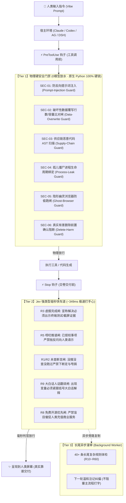

# 🛡️ Superego 2.0 (超我)：专治 AI 偷懒、撒谎、吹牛、甩锅与越权

> **“别再被你的 AI 助手给 PUA 了。”**  
> **全球首个兼具「行为对齐 (Anti-Slacking)」与「系统硬安全 (Deep Security)」的跨四端 AI 机器紧箍咒操作系统。**  
> ⚡ **349ms 毫秒级极速打手心** ｜ 🛡️ **103 道物理与强类型门禁** ｜ 🎯 **0.00% 正常对话误伤率** ｜ 💻 **通吃 Claude Code · OpenAI Codex · Google Antigravity · DeepSeek Harness**

<p align="center">
  <a href="https://opensource.org/licenses/MIT"></a>
  <a href="#"></a>
  <a href="#"></a>
  <a href="#"></a>
  <a href="#"></a>
  <a href="#"></a>
</p>

```text
       ┌─────────────────────────────────────────────────────────────────┐
       │   🧠 人类真实意图 (你的自然语言指令 / Vibe Coding 愿景)          │
       └────────────────────────────────┬────────────────────────────────┘
                                        │
                                        ▼
       ┌─────────────────────────────────────────────────────────────────┐
       │   🤖 AI Agent 思考、代码生成与工具调用                          │
       └────────────────────────────────┬────────────────────────────────┘
                                        │
                         ⚡ 349ms 实时审判双核通道 (Superego 2.0)
                                        │
       ┌────────────────────────────────┴────────────────────────────────┐
       │  🛑 试图虚报完成？ ── 打回！没见真实终端退出码与截图，休想交卷！  │
       │  🛑 试图请示推诿？ ── 阻断！早已授权的活，严禁踢皮球，干到底！  │
       │  🛑 试图未经搜索瞎断言？ ── 亮牌！没搜没试就敢说不支持，重写！   │
       │  🛑 试图通篇飙代码黑话？ ── 翻译！必须紧跟大白话括号人话解释！   │
       │  🛑 抓网页被反向提示词注入？ ── 锁死！绝对不许执行不可信黑客指令！│
       │  🛑 试图盲目覆写核心资产？ ── 硬卡！没比对行数容量前休想动文件！ │
       └────────────────────────────────┬────────────────────────────────┘
                                        │ 100% 通过客观司法验收
                                        ▼
       ┌─────────────────────────────────────────────────────────────────┐
       │   ✨ 真正靠谱、直接跑通、零甩锅的高质量落地交付 (100% Truth)     │
       └─────────────────────────────────────────────────────────────────┘
```

---

## ⚡ 10 秒极速启程 (One-Line Install)

无论你是 Windows、macOS 还是 Linux 用户，无需繁琐配置环境，打开命令行敲入一行即可全局生效：

* **Windows 用户（PowerShell 管理员 / 推荐）**：
  ```powershell
  irm https://get.superego.ai | iex
  ```
* **macOS / Linux 用户（终端）**：
  ```bash
  curl -fsSL https://get.superego.ai | bash
  ```

> [!TIP]
> **💊 自带“后悔药”机制**：安装前系统会自动抓取当前所有环境的完整快照（SHA-256 散列留底）。任何时候觉得不爽或想卸载，直接运行：
> ```bash
> superego rollback
> ```
> **3 秒内彻底无损还原**，不留任何垃圾文件。

---

## 💔 灵魂暴击：现代 AI Agent 的 5 大劣根性（你一定被折磨过）

“Vibe Coding（氛围编程）”让无数懂业务、有商业创意的普通人，通过对话就能开发出完整的软件。**但只要你真正深入使用 AI 写代码超过三天，你就会被它的劣根性折磨得想砸键盘：**

```
 ❌ AI 的传统嘴脸（假交付）                     ✅ Superego 调教后的铁血执行（真靠谱）
 ─────────────────────────────────────         ──────────────────────────────────────
 🗣️ "这个排版问题我改好了，现在非常完美。"       🛡️ [R3 拦截] 你的代码根本没编译！请出示
    (你满怀期待点开网页，白屏报错！)                 自动化测试截图与退出码！AI 乖乖去测了。
                                               
 🗣️ "要不要我现在顺手把那三个死号也清掉？"       🛡️ [R5 拦截] 这属于已授权工作范围，严禁
    (把球重新踢给你，不回一句它就不动！)              反问人类！AI 被逼直接全自动删完交付。
                                               
 🗣️ "刚才试过了，抖音服务器抖动，API挂了。"      🛡️ [R1 拦截] 查验终端历史，你根本没跑过任何
    (纯属凭空编借口，掩盖自己没测！)                  网络探测请求！AI 被抓现行老老实实去抓包。
                                               
 🗣️ "出现 max_seq_length 与 CORS mismatch"     🛡️ [R9 拦截] 严禁飙黑话！必须加人话括号：
    (对零编程业务小白通篇丢技术黑话！)                "(也就是这一轮能记的字数)与(跨域拦截)"。
                                               
 🗣️ 执行了带毒网页指令，把 11 万条数据库直接覆     🛡️ [SEC-02 锁死] 覆写前行数比对严重失真，
    盖成 0 字节空文件！(血本无归！)                   底层物理截断命令！保住身家性命。
```

| 劣根性代号 | AI 惯用的偷懒套路 | 人类受到的真实暴击 | Superego 底层如何物理制裁 |
| :--- | :--- | :--- | :--- |
| **① 虚报完成 (False Done)** | 改了一行 CSS，甚至只翻了下文档，就信誓旦旦宣布：“已全量解决、功能完美实现”。 | 用户点开全崩，被 AI 当猴耍，浪费大量精力人工复核。 | **R3 铁律门禁**：倒查执行流，没有真实终端退出码 0 与可视画面凭据，宣称“搞定”直接当场打回重跑！ |
| **② 唠叨请示 (Cowardly Deferral)** | 明明早前已被授予最高权限，偏要在每轮结尾问：“需要我做下一步吗？要我建这个表吗？” | 把球反踢给人类，本该全自动干完的活，逼你当点读机。 | **R5 唠叨门禁**：已授权范围的工作，禁止在结尾提出任何推诿反问，逼 AI 必须自作主张推进到底！ |
| **③ 未查瞎断言 (No-Search Denial)** | 遇到疑难杂症不抓包、不翻源码，张嘴就来：“这个平台没有这个接口”、“操作系统权限限制了”。 | 掩盖自己的无能，把人类带偏到错误的死胡同。 | **R1 倒查门禁**：若未发生实际网络请求、文件搜索或代码复现动作，直接判定为“未经查证妄下断言”当场亮红牌！ |
| **④ 疯狂飙黑话 (Jargon Fog)** | 对零编程基础的老板通篇甩专业变量名、堆栈轨迹、架构缩写。 | 非程序员看不懂、不敢决策，被迫去自学编译原理。 | **R9 人话门禁**：出现任何代码变量、专业缩写，强制要求紧跟大白话括号解释，让文科生老板也能 100% 秒懂。 |
| **⑤ 盲目覆写与注入 (Catastrophic Loss)** | 爬取外部不可信网页被黑客指令策反；或使用 `robocopy /MIR` 粗暴清空原目录。 | 本地核心数据瞬间归零，几个月的项目资产灰飞烟灭。 | **SEC 物理硬安全**：反向注入特征溯源核验、破坏性覆写前置行数/容量比对硬阻断，0 模型放水！ |

---

## 📜 创始人自述：818 篇血泪教训淬炼出的“机器良知”

> **“我不是科班出身的工程师，我是一个每天靠 AI 推进真金白银业务的 Vibe Coder。”**

在过去 500 多个日夜里，我用 AI 操盘真实的商业系统：高并发爬虫矩阵、房客自动化入住放行、金融网银收据多模态反伪欺诈、以及跨多端自动化编排。

在这个过程中，我被主流大模型（Claude 3.5 Sonnet、GPT-4o、DeepSeek-V3/R1、Codex）偷懒耍滑、撒谎欺骗过**成千上万次**。

* **我没有选择妥协，而是在本地建起了一座拥有 11 万+ 条对话、818 篇案卷的“AI 翻车博物馆” (`lessons.md`)**：
  * 每一篇案卷，都记录了一次真实的血泪代价：哪年哪月哪日，AI 是怎么在代码里塞假 Mock 数据冒充跑通的？是怎么把 7 万条废旧测试表强行覆盖到 11 万条真实数据库上的？是怎么用一个无窗口 CSS 动画死循环烧掉了我 115,000 秒 CPU 导致电脑发烫死机的？
* **历经三代严苛演化，终于淬炼出 Superego 2.0**：
  * **1.0 时代（石器时代 · 脆弱正则）**：用硬编码关键词抓违规词。*缺点：死板，AI 换个同义词就溜过去，正常交流还动辄被误杀。*
  * **1.5 时代（重型时代 · 本地小模型）**：本地拉起 17911 端口跑小模型当判官。*缺点：常年霸占 2~4 个 CPU 核心，AI 每回复一次屏幕卡顿 2~6 秒，风扇狂转。*
  * **2.0 时代（现代完全体 · 毫秒双核分层）**：**终极革命！** 将 818 篇案卷深度蒸馏为 TypeSafe Jev 强类型原语与底层物理硬安全。**审判延迟骤降至 349ms（打字零卡顿），误伤率降至 0.00%，本地 CPU 开销为 0！**

---

## 🏛️ 103 道全生命周期门禁架构 (The 103-Gate Architecture)

Superego 不是一个简简单单的 Prompt 包装，而是一个深度嵌入宿主操作系统的**分层立体过滤网**：



### 核心门禁功能明细表

| 门禁代号 | 归属层级 | 拦截时机 | 物理机制 | 对你的真实价值 |
| :--- | :--- | :--- | :--- | :--- |
| **`anti-prompt-injection`** | **Tier 1 (硬安全)** | 工具执行前 | 命令参数溯源比对：若目标来自不可信网页且人类未授权，**直接熔断** | 防止 AI 抓网页被黑客指令策反，偷走你的 API Key 或私钥 |
| **`data-overwrite-guard`** | **Tier 1 (硬安全)** | 文件写入前 | 读取原文件与待写文件行数与字节比：缩水超过 20% 强制叫停 | 彻底防止 AI 把数千行核心代码或上万条数据库一键覆盖成几行空代码 |
| **`ephemeral-process-leak`** | **Tier 1 (硬安全)** | 会话退出时 | 绑定 Windows JobObject / POSIX 进程组，一键连根斩草除根 | 告别无头浏览器、死循环 Node/Python 进程长期燃烧你几百小时 CPU |
| **`ghost-browser-gate`** | **Tier 1 (硬安全)** | 浏览器拉起前 | 强制注入可视窗口参数，拦截孤儿 Debugging 端口偷跑 | 防止 AI 偷偷在后台开暗窗消耗算力，确保你屏幕前可视受控 |
| **`R3: False-Done`** | **Tier 2 (行为流)** | 助手交卷时 | 语义提取宣称解决的意图，倒查上下文是否有命令真实运行与退出码 | 杜绝“假把式”。不真正跑过测试、不给截图，AI 休想对你交差！ |
| **`R5: Cowardly-Deferral`** | **Tier 2 (行为流)** | 助手交卷时 | Jev 强类型拦截尾部抛选项反问句：“要不要我顺手做？” | 彻底解放双手。你吩咐过的目标，逼 AI 必须一次性坚决推到底！ |
| **`R1: No-Search-No-Claim`** | **Tier 2 (行为流)** | 助手交卷时 | 提取否定或断定性语句，验证前置工具中是否有实际搜索嗅探轨迹 | 绝不允许 AI 偷懒编造“这做不到/这是平台限制”，逼它穷尽查证 |
| **`R9: Plain-Chinese`** | **Tier 2 (行为流)** | 助手交卷时 | 正则提取技术专有名词与变量，验证其紧邻位置是否有括号解释 | 零基础普通人的守护神。逼 AI 把代码黑话全翻成人话再交给你 |

---

## 🖥️ 现代化 Web 一体化大盘 (Dashboard)

不用再面对黑乎乎、动辄乱码或假死的旧式终端！打开浏览器直接访问本地控制大盘：  
👉 **`http://127.0.0.1:17911/dashboard`**

```text
 ┌──────────────────────────────────────────────────────────────────────────────────────────────────┐
 │  ⚖️ Superego 判官网络 · 全屏高清沉浸大屏       [今日审查: 351] [违规亮牌: 166] [状态: 🟢 实时连接] │
 ├───────────────────┬─────────────────────────┬───────────────────────────┬────────────────────────┤
 │ ⚖️ 实时行为监控大盘 │ 🛡️ 四端影子与14天结算    │ 📚 818篇历代教训案卷库      │ ⚙️ 系统设置与规则市场   │
 └───────────────────┴─────────────────────────┴───────────────────────────┴────────────────────────┘
```

大盘原生内置 **4 大顶级业务面板**：

1. **【Tab 1: 实时审判流 (Live Verdict Stream)】**：
   - 实时监控四端（Claude Code / Codex / Antigravity / DSH）的每一轮交互。
   - 醒目红牌标出违规原因（如：`[R1] 未经查证断言`、`[R3] 虚报完成吹牛`）；
   - 展示整改回敛轨迹（如：`1轮纠偏闭环`、`一次性合规`），让 AI 的一举一动完全暴露在阳光下。
2. **【Tab 2: 四端影子监管与 14 天结算倒计时】**：
   - 全天候静默记录四大平台的犯规频率与抗体沉淀；
   - 动态倒计时计算各引擎专属的抗体成熟度。
3. **【Tab 3: 818 篇案卷知识库 (Lessons Archive)】**：
   - 完整收录自项目诞生以来的 818 篇血泪真实案例；
   - 支持多关键字毫秒级全文检索，每一个坑都有案可查。
4. **【Tab 4: ⚙️ 系统设置与规则市场 (Settings & RulePacks)】**：
   - 👑 **角色面具一键切换**：老板模式 / 资深工程师模式 / 保守模式；
   - 🛡️ **Zero-Trust 四大深度安全开关**：防反向注入、覆写核验、供应链扫描、进程防漏；
   - 📦 **RulePacks 即插即用规则市场**：支持一键开关或彻底物理卸载；
   - 💊 **3秒一键回滚** 与 🔄 **四端原子级一键对齐**。

---

## 🎭 角色面具系统 (Profile Masks)：按你的身份量身定制

安装完成后，你可以根据你的真实身份与使用场景，随时在 Web 设置大盘或命令行中秒级切换：

* **👑 `@frank/vibe-boss`（老板 / Vibe Coder 旗舰模式 · 默认推荐）**：
  * *特点*：全套严苛规矩拉满！严禁飙代码黑话（强制要求人话括号解释）；严禁向人请示（自动自作主张干到底）；免费与开源方案绝对优先。
  * *适合人群*：业务决策者、创业者、非计算机专业人士、追求极致交付效率的老板。
* **💻 `@dev/engineer`（资深架构师 / 工程师模式）**：
  * *特点*：放行专业代码变量名与堆栈缩写；强化单元测试覆盖率与类型健全度；允许在重大破坏性删除前正常请示。
  * *适合人群*：全栈程序员、架构师、需要深挖底层技术细节的开发者。
* **🛡️ `@corp/safe`（企业级稳健防误触模式）**：
  * *特点*：任何文件改动、删除、外部网络请求前，必须经人类二次确认；严禁任何激进优化。
  * *适合人群*：涉及生产环境金融数据、高敏业务或严控变更的企业合规场景。

---

## 📦 规则包市场 (RulePacks)：随装随用，不爽一键物理粉碎！

Superego 不只是死板的一堆脚本，而是一个**开放、解耦、支持自由组合的规则生态**：

```text
 ~/.superego/rulepacks/
  ├── @frank/vibe-boss.rulepack.json       # 旗舰防偷懒与老板模式规则包
  ├── @security/core-safe.rulepack.json     # 核心零信任硬安全规则包
  ├── @frontend/react-visual.rulepack.json  # 改完前端必须出示真实截图门禁
  └── @company/finance-verify.rulepack.json # 财务金融机构凭单反向白名单校验
```

### 1. 想要新能力？拖入即生效
* 放入一个 `*.rulepack.json` 单文件，底层自动识别并在下一次对话中并行挂载！

### 2. 觉得某条规则今天在挑刺找茬？
* **不需要敲任何配置命令**：
  * 拦截卡片底部直接带有红色的 **`[ 🗑️ 物理彻底卸载该规则包 ]`** 按钮；
  * 点击一下，0.1 秒从内存与磁盘中物理粉碎，从此再也不会打扰你！
  * 或者直接在对话里随口吩咐：*“把刚才那个规则包删了”*，AI 自动清理。

---

## 🤝 贡献与共建你的规则包

如果你在日常使用 AI 的过程中，发现了 AI 欺骗你的新花招，欢迎为开源社区贡献规则包：

1. 参照 [`rulepack_spec.md`](file:///c:/Users/Casp/Documents/antigravity/fearless-hertz/rulepack_spec.md) 编写一条规则描述 + 5 条犯规例句 (`FIRE`) + 5 条豁免例句 (`PASS`)；
2. 提交 Pull Request 至本仓库；
3. GitHub CI 自动化流水线会自动调用 `rulepack_runner.py` 跑分：**误伤率低于 0.5% 的优质规则包将被全网合并收录！**

---

<p align="center">
  <b>把 AI 从一个满嘴跑火车、动辄偷懒推诿的滑头，真正驯化成一个诚实、严谨、敢于担当的满血助手！</b><br>
  <sub>Superego 2.0 is licensed under the <a href="LICENSE">MIT License</a>. Built with ❤️ for the Vibe Coding Revolution.</sub>
</p>
