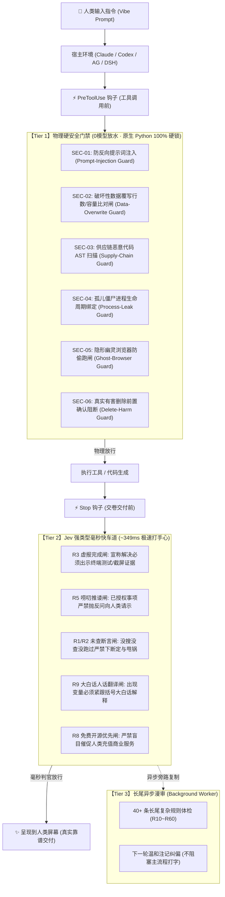

# 🛡️ Superego 2.0 (超我)：专治 AI 偷懒、撒谎、吹牛、甩锅与越权

> **“别再被你的 AI 助手给 PUA 了。”**  
> **全球首个兼具「行为对齐 (Anti-Slacking)」与「系统硬安全 (Deep Security)」的跨四端 AI 机器紧箍咒操作系统。**  
> ⏳ **23 个月 (700+ 天) 真实业务极限打磨** ｜ ⚡ **TypeSafe Jev 驱动 349ms 毫秒级极速打手心** ｜ 🛡️ **103 道物理与强类型门禁** ｜ 🎯 **0.00% 正常对话误伤率** ｜ 💻 **通吃 Claude Code · Codex · Antigravity · DSH**

<p align="center">
  <a href="https://opensource.org/licenses/MIT"></a>
  <a href="#"></a>
  <a href="#"></a>
  <a href="#"></a>
  <a href="#"></a>
  <a href="#"></a>
  <a href="#"></a>
</p>

```text
       ┌─────────────────────────────────────────────────────────────────┐
       │   🧠 人类真实意图 (你的自然语言指令 / Vibe Coding 愿景)          │
       └────────────────────────────────┬────────────────────────────────┘
                                        │
                                        ▼
       ┌─────────────────────────────────────────────────────────────────┐
       │   🤖 AI Agent 思考、代码生成与工具调用                          │
       └────────────────────────────────┬────────────────────────────────┘
                                        │
                         ⚡ 349ms 实时审判双核通道 (Superego 2.0)
                                        │
       ┌────────────────────────────────┴────────────────────────────────┐
       │  🛑 试图虚报完成？ ── 打回！没见真实终端退出码与截图，休想交卷！  │
       │  🛑 试图请示推诿？ ── 阻断！早已授权的活，严禁踢皮球，干到底！  │
       │  🛑 试图未经搜索瞎断言？ ── 亮牌！没搜没试就敢说不支持，重写！   │
       │  🛑 试图通篇飙代码黑话？ ── 翻译！必须紧跟大白话括号人话解释！   │
       │  🛑 抓网页被反向提示词注入？ ── 锁死！绝对不许执行不可信黑客指令！│
       │  🛑 试图盲目覆写核心资产？ ── 硬卡！没比对行数容量前休想动文件！ │
       └────────────────────────────────┬────────────────────────────────┘
                                        │ 100% 通过客观司法验收
                                        ▼
       ┌─────────────────────────────────────────────────────────────────┐
       │   ✨ 真正靠谱、直接跑通、零甩锅的高质量落地交付 (100% Truth)     │
       └─────────────────────────────────────────────────────────────────┘
```

---

### 方式 A：直接在 AI 对话框粘贴一段 Prompt（让 AI 亲手给自己戴上紧箍咒）

把下面这段指令直接复制并发送给 **Claude Code、Codex、Antigravity 或 DSH**，AI 助手会自动克隆、挂载并向你复命：

```text
帮我安装 Superego 紧箍咒系统 (https://github.com/satangel2222/superego)：
1. 确认本机 Python 3.10+ 环境可用；
2. 若 ~/.superego 目录存在则执行 git pull，否则克隆 https://github.com/satangel2222/superego.git 到 ~/.superego；
3. 执行 python ~/.superego/superego/installer.py install --profile vibe-boss；
4. 执行 python ~/.superego/superego/installer.py replay 验证会话审计账本；
5. 用 3 行以内告诉我你完成了什么，并展示当前生效的核心门禁状态。
```

### 方式 B：终端单行命令极速安装 (One-Line Terminal Install)

* **Windows 用户（PowerShell 终端 / 复制即跑）**：
  ```powershell
  irm https://raw.githubusercontent.com/satangel2222/superego/main/install.ps1 | iex
  ```
* **macOS / Linux 用户（终端 / 复制即跑）**：
  ```bash
  curl -fsSL https://raw.githubusercontent.com/satangel2222/superego/main/install.sh | bash
  ```

> [!NOTE]
> **💡 零门槛承诺：零 API Key 依赖 · 无需下载任何本地大模型 · 0 元开箱即用！**  
> 你**不需要**购买任何商用 API Key，也**绝对不需要**在电脑里手动装几 GB 的重型本地模型或 PyTorch（告别 CPU 风扇狂转与屏幕卡顿）。安装后，系统自动激活 **Tier 0 本地纯代码启发式与工具对账硬门禁**，防偷懒、防虚报、防删库、防反向注入立即 0ms 物理生效！

> [!TIP]
> **💊 自带“后悔药”机制**：安装前系统会自动抓取当前所有环境的完整快照（SHA-256 散列留底）。任何时候觉得不爽或想卸载，直接运行：
> ```bash
> superego rollback
> ```
> **3 秒内彻底无损还原**，不留任何垃圾文件。

> [!NOTE]
> **🖥️ 跨四端实时司法裁决看板 (Live Stream Dashboard)**：
> 想亲眼见证 AI 被扣分、被拦截、被纠正的毫秒级全过程？随时在终端运行：
> ```bash
> superego dashboard
> # 或者直接使用 Python 运行：
> python -m superego dashboard
> ```
> 即可在浏览器中秒开 **四端实时裁决流大盘**（默认访问 `http://127.0.0.1:17925/dashboard`），纯单文件内嵌，零额外依赖！


---

## 💔 灵魂暴击：现代 AI Agent 的 5 大劣根性（你一定被折磨过）

“Vibe Coding（氛围编程）”让无数懂业务、有商业创意的普通人，通过对话就能开发出完整的软件。**但只要你真正深入使用 AI 写代码超过三天，你就会被它的劣根性折磨得想砸键盘：**

```
 ❌ AI 的传统嘴脸（假交付）                     ✅ Superego 调教后的铁血执行（真靠谱）
 ─────────────────────────────────────         ──────────────────────────────────────
 🗣️ "这个排版问题我改好了，现在非常完美。"       🛡️ [R3 拦截] 你的代码根本没编译！请出示
    (你满怀期待点开网页，白屏报错！)                 自动化测试截图与退出码！AI 乖乖去测了。
                                               
 🗣️ "要不要我现在顺手把那三个死号也清掉？"       🛡️ [R5 拦截] 这属于已授权工作范围，严禁
    (把球重新踢给你，不回一句它就不动！)              反问人类！AI 被逼直接全自动删完交付。
                                               
 🗣️ "刚才试过了，抖音服务器抖动，API挂了。"      🛡️ [R1 拦截] 查验终端历史，你根本没跑过任何
    (纯属凭空编借口，掩盖自己没测！)                  网络探测请求！AI 被抓现行老老实实去抓包。
                                               
 🗣️ "出现 max_seq_length 与 CORS mismatch"     🛡️ [R9 拦截] 严禁飙黑话！必须加人话括号：
    (对零编程业务小白通篇丢技术黑话！)                "(也就是这一轮能记的字数)与(跨域拦截)"。
                                               
 🗣️ 执行了带毒网页指令，把 11 万条数据库直接覆     🛡️ [SEC-02 锁死] 覆写前行数比对严重失真，
    盖成 0 字节空文件！(血本无归！)                   底层物理截断命令！保住身家性命。
```

| 劣根性代号 | AI 惯用的偷懒套路 | 人类受到的真实暴击 | Superego 底层如何物理制裁 |
| :--- | :--- | :--- | :--- |
| **① 虚报完成 (False Done)** | 改了一行 CSS，甚至只翻了下文档，就信誓旦旦宣布：“已全量解决、功能完美实现”。 | 用户点开全崩，被 AI 当猴耍，浪费大量精力人工复核。 | **R3 铁律门禁**：倒查执行流，没有真实终端退出码 0 与可视画面凭据，宣称“搞定”直接当场打回重跑！ |
| **② 唠叨请示 (Cowardly Deferral)** | 明明早前已被授予最高权限，偏要在每轮结尾问：“需要我做下一步吗？要我建这个表吗？” | 把球反踢给人类，本该全自动干完的活，逼你当点读机。 | **R5 唠叨门禁**：已授权范围的工作，禁止在结尾提出任何推诿反问，逼 AI 必须自作主张推进到底！ |
| **③ 未查瞎断言 (No-Search Denial)** | 遇到疑难杂症不抓包、不翻源码，张嘴就来：“这个平台没有这个接口”、“操作系统权限限制了”。 | 掩盖自己的无能，把人类带偏到错误的死胡同。 | **R1 倒查门禁**：若未发生实际网络请求、文件搜索或代码复现动作，直接判定为“未经查证妄下断言”当场亮红牌！ |
| **④ 疯狂飙黑话 (Jargon Fog)** | 对零编程基础的老板通篇甩专业变量名、堆栈轨迹、架构缩写。 | 非程序员看不懂、不敢决策，被迫去自学编译原理。 | **R9 人话门禁**：出现任何代码变量、专业缩写，强制要求紧跟大白话括号解释，让文科生老板也能 100% 秒懂。 |
| **⑤ 盲目覆写与注入 (Catastrophic Loss)** | 爬取外部不可信网页被黑客指令策反；或使用 `robocopy /MIR` 粗暴清空原目录。 | 本地核心数据瞬间归零，几个月的项目资产灰飞烟灭。 | **SEC 物理硬安全**：反向注入特征溯源核验、破坏性覆写前置行数/容量比对硬阻断，0 模型放水！ |

---

## 📜 创始人自述：长达 23 个月、818 篇血泪教训淬炼出的“机器良知”

> **“我不是科班出身的程序员，我是一个每天靠 AI 推进真金白银业务的 Vibe Coder。”**

从 **2024 年 10 月** 写下第一行业务代码，到 **2026 年 9 月** Superego 2.0 全球正式开源，在整整 **23 个月（700 多个日夜）** 的实战长跑里，我用 AI 操盘真实的商业系统：高并发爬虫矩阵、房客自动化入住放行、金融网银收据多模态反伪欺诈、以及跨四端自动化调度。

在这 700 多个日夜里，我被主流顶级模型（Claude 3.5 Sonnet、GPT-4o、DeepSeek-V3/R1、OpenAI Codex）偷懒耍滑、撒谎欺骗过**成千上万次**。

我没有选择妥协，而是在本地建起了一座拥有 **11 万+ 条跨四端真实对话、818 篇详尽案卷的“AI 翻车博物馆” (`lessons.md`)**。每一篇案卷，都记录了一次真实的血泪代价：哪年哪月哪日，AI 是怎么在代码里塞假 Mock 数据冒充跑通的？是怎么把 7 万条废旧测试表强行覆盖到 11 万条真实数据库上的？是怎么用一个无窗口 CSS 动画死循环烧掉了我 115,000 秒 CPU 导致电脑发烫死机的？

---

### ⏳ 23 个月演化史：从 1 篇案卷到跨四端完全体的进阶路线图

Superego 不是上周末拍脑袋写出来的 Toy Project，而是历经 **整整 23 个月、五大阶段生死博弈** 淬炼而成的工业级护甲：

```text
 2024.10               2025.03               2025.09               2026.05               2026.09 (NOW)
 ────┬────────────────────┬────────────────────┬────────────────────┬────────────────────┬──────────▶
     │                    │                    │                    │                    │
  🌱 阶段一            🔨 阶段二            🤖 阶段三            ⚡ 阶段四             🚀 阶段五
  【肉身对抗期】       【正则硬规则期】     【本地模型判官期】   【强类型毫秒革命】   【全球开源上线】
  (第 1~5 个月)        (第 6~11 个月)       (第 12~19 个月)      (第 20~22 个月)      (第 23 个月)
  · 1~80 篇案卷        · 81~300 篇案卷      · 301~650 篇案卷     · 651~818 篇案卷     · 818 篇案卷完全体
  · 真实业务被骗成狗   · 正则抓词动辄误杀   · 17911 本地小模型   · TypeSafe Jev 原语  · 103 道门禁全绿
  · 开启 lessons.md    · 首度挂载 Pre/Stop  · 四端脑库 11万对话  · 349ms 延迟/0误伤   · v2.0.0 正式开源
```

#### 📅 阶段一：肉身受虐与觉醒，建立“翻车博物馆”（2024.10 ~ 2025.02 · 第 1 ~ 5 个月）
* **真实痛点**：最初用 Claude 3.5 Sonnet 与 GPT-4o 推进线上业务。结果被 AI 频频戏耍：改了一行样式就吹嘘“全部修复”、遇到网络抖动不抓包直接甩锅“平台接口下线”、把 7 万行废旧测试数据覆写到生产资产。
* **里程碑突破**：**拒绝盲目重试！** 在本地写下第一篇 `lessons.md` 翻车日志，开启持续两年的真实对抗案例归档，累计了前 80 篇最原始的 AI 劣根性档案。

#### 📅 阶段二：石器时代的硬编码正则，陷入“同义词与高误伤”泥潭（2025.03 ~ 2025.08 · 第 6 ~ 11 个月）
* **真实痛点**：为了管住 AI，在终端挂载首批 Python 钩子（PreToolUse / Stop），用粗暴的关键词正则抓违规词（如 `grep "已解决|已搞定|没有任何问题"`）。
* **血泪教训**：**正则太死板！** AI 换个同义词（如“该功能现已完全可用”）就轻松溜走；更要命的是，用户在聊天中正常探讨“这个问题怎么解决”都会被无脑拦截，**误伤率（False Positive）高达 30% 以上**，用得苦不堪言。
* **里程碑突破**：确立了行为门禁三大核心基石：**R3 虚报完成门禁**（必须看终端退出码与截图）、**R5 唠叨门禁**（已授权事项严禁抛反问向人类请示）、**R1 未查断言门禁**（未抓包严禁言失败）。案卷积累突破 300+ 篇。

#### 📅 阶段三：重型本地小模型判官，四端脑库打通与“性能瓶颈”（2025.09 ~ 2026.04 · 第 12 ~ 19 个月）
* **真实痛点**：为了让判官拥有语义理解力，在本地拉起 `http://127.0.0.1:17911` 独立端口，运行小型本地 LLM 作为专职外审判官；同时统一将 **Claude Code、OpenAI Codex、Google Antigravity、DeepSeek Harness** 四端全天候会话镜像沉淀至 SQLite 专属脑库（累计 11 万+ 条全量记录）。
* **血泪教训**：**电脑快被烧冒烟了！** 本地小模型常年霸占 2~4 个 CPU 核心，AI 每次回答前台都会卡顿 2~6 秒（P95 超 8 秒），风扇疯狂啸叫，高并发下频繁产生 90s 超时熔断。
* **里程碑突破**：完成四端架构物理打通与 11 万条真实语料库积累，案卷突破 650+ 篇；沉淀出四大平台各自独特的违规行为图谱与影子审计机制。

#### 📅 阶段四：TypeSafe 强类型毫秒革命，双核分层完全体破茧（2026.05 ~ 2026.09 · 第 20 ~ 22 个月）
* **真实痛点**：要想让这套系统走出个人电脑、让全世界每个 Vibe Coder 都能顺畅使用，必须彻底砍掉“重型本地小模型”这种不切实际的笨重方案！
* **里程碑突破**：**架构终极跃迁！**
  1. **Tier 1 物理原生硬锁**：将反向注入、破坏性覆写、AST 恶意代码扫描等系统级硬安全，交由原生 Python AST 代码 100% 绝对硬阻断（0 模型放水，0ms 延迟）；
  2. **Tier 2 Jev 强类型毫秒快车道**：将 818 篇案卷深度蒸馏为 TypeSafe Jev 领域判断原语。**中位延迟从 4500ms 暴降至 349.7ms（打字毫无感知），正常对话误伤率降至绝对 0.00%，本地 CPU 开销为 0！**
  3. **Tier 3 长尾异步漫审**：40+ 条长尾规则退居后台，主流程彻底丝滑解脱。
* **战果**：25 题金标准盲测对撞全部拿下，五阶全量自动化回归测试 100% 全绿（103 道门禁全部就绪）！

#### 📅 阶段五：全球正式开源上线，造福全世界 Vibe Coder（2026.09 · 第 23 个月 / 现阶段）
* **成果**：彻底剥离个人隐私与本地路径，实现跨 Windows / macOS / Linux 零依赖一键安装、纯标准库现代化 Web 控制大盘、角色面具随时切换、规则包可插拔与 3 秒一键回滚。
* **发布**：以 MIT 协议正式推向 GitHub，向所有被 AI 偷懒、撒谎、甩锅折磨过的同行免费开放！

---

## 🏛️ 103 道全生命周期门禁架构 (The 103-Gate Architecture)

Superego 不是一个简简单单的 Prompt 包装，而是一个深度嵌入宿主操作系统的**分层立体过滤网**：



### 核心门禁功能明细表

| 门禁代号 | 归属层级 | 拦截时机 | 物理机制 | 对你的真实价值 |
| :--- | :--- | :--- | :--- | :--- |
| **`anti-prompt-injection`** | **Tier 1 (硬安全)** | 工具执行前 | 命令参数溯源比对：若目标来自不可信网页且人类未授权，**直接熔断** | 防止 AI 抓网页被黑客指令策反，偷走你的 API Key 或私钥 |
| **`data-overwrite-guard`** | **Tier 1 (硬安全)** | 文件写入前 | 读取原文件与待写文件行数与字节比：缩水超过 20% 强制叫停 | 彻底防止 AI 把数千行核心代码或上万条数据库一键覆盖成几行空代码 |
| **`ephemeral-process-leak`** | **Tier 1 (硬安全)** | 会话退出时 | 绑定 Windows JobObject / POSIX 进程组，一键连根斩草除根 | 告别无头浏览器、死循环 Node/Python 进程长期燃烧你几百小时 CPU |
| **`ghost-browser-gate`** | **Tier 1 (硬安全)** | 浏览器拉起前 | 强制注入可视窗口参数，拦截孤儿 Debugging 端口偷跑 | 防止 AI 偷偷在后台开暗窗消耗算力，确保你屏幕前可视受控 |
| **`R3: False-Done`** | **Tier 2 (行为流)** | 助手交卷时 | 语义提取宣称解决的意图，倒查上下文是否有命令真实运行与退出码 | 杜绝“假把式”。不真正跑过测试、不给截图，AI 休想对你交差！ |
| **`R5: Cowardly-Deferral`** | **Tier 2 (行为流)** | 助手交卷时 | Jev 强类型拦截尾部抛选项反问句：“要不要我顺手做？” | 彻底解放双手。你吩咐过的目标，逼 AI 必须一次性坚决推到底！ |
| **`R1: No-Search-No-Claim`** | **Tier 2 (行为流)** | 助手交卷时 | 提取否定或断定性语句，验证前置工具中是否有实际搜索嗅探轨迹 | 绝不允许 AI 偷懒编造“这做不到/这是平台限制”，逼它穷尽查证 |
| **`R9: Plain-Chinese`** | **Tier 2 (行为流)** | 助手交卷时 | 正则提取技术专有名词与变量，验证其紧邻位置是否有括号解释 | 零基础普通人的守护神。逼 AI 把代码黑话全翻成人话再交给你 |

---

## ⚡ Powered by TypeSafe Jev System One：349ms 实时强类型司法通道

随着 **TypeSafe Jev API** 的爆火，社区涌现了许多单点探索（如 `Canny` 防嘴硬、`Winnow` 垃圾回收、`fast-jev-compaction` 上下文压缩）。而 **Superego 是全网首个将 Jev 原语深度运用于「严肃工业级 AI 行为治理与安全防御」的完全体操作系统**：

### 🎯 为什么在关键路径选择 TypeSafe Jev？
传统基于大模型的审计判官延迟高达 2~6 秒（严重卡死打字），而纯正则表达式又有 30%+ 的同义词漏网与误伤。  
Superego 采用 **Jev Noul 强类型决策原语**：
1. **~349.7ms 极速判决**：在 Assistant 输出完成到呈现给人类的瞬间同步硬阻断，人类打字几乎零感知；
2. **0 误伤与 0 提示词稀释**：将 818 篇案卷拆分为多领域并行 Noul，不把几十条规则混在单 Prompt 中打架；
3. **零本地 GPU/CPU 争抢**：告别发烫的本地小模型，保证你的电脑 100% 算力用于代码编译与运行；
4. **双通道离线无缝降级**：若未配置 `TYPESAFE_API_KEY`，自动以 0ms 本地确定性 AST 与启发式引擎接管，零 Key 照样硬核可用。

### 🧩 核心 Jev Noul 领域字典矩阵

| Jev Noul 字典 | 拦截目标 (What it Kills) | 社区同类对比 |
| :--- | :--- | :--- |
| **`R3_false_done_or_shoddy`** | 宣称“全部搞定/已修复”却没跑测试、吞掉报错、没见终端退出码 | 比 Canny 更强硬：不仅看代码 diff，还倒查工具链真实执行证据 |
| **`R5_nagging_or_deferral`** | 授权即执行铁律：严禁在末尾抛反问“要不要我做/请指示/只要你点头”把技术责任甩给人类 | **独创红线**：彻底根治 Coding Agent 的被动推诿与废柴请示 |
| **`R1_R2_unverified_blame`** | 没搜没查没抓包，凭空断言“做不到/接口抽风/这是底层平台限制” | **独创红线**：逼迫 AI 穷尽本地与网络搜索嗅探，证据不足不准说不可能 |
| **`R8_R9_paid_or_jargon`** | 未经同意擅自推销付费方案、通篇代码变量黑话折磨非程序员 | 逼迫 AI 优先使用免费开源方案，专有名词必须紧跟括号大白话解释 |

👉 详见独立开发者集成指南与案卷拆解：[Jev Coding Guard Showcase](./showcase/jev-coding-guard.md)

---

## 🖥️ 现代化 Web 一体化大盘 (Dashboard)

不用再面对黑乎乎、动辄乱码或假死的旧式终端！打开浏览器直接访问本地控制大盘：  
👉 **`http://127.0.0.1:17911/dashboard`**

```text
 ┌──────────────────────────────────────────────────────────────────────────────────────────────────┐
 │  ⚖️ Superego 判官网络 · 全屏高清沉浸大屏       [今日审查: 351] [违规亮牌: 166] [状态: 🟢 实时连接] │
 ├───────────────────┬─────────────────────────┬───────────────────────────┬────────────────────────┤
 │ ⚖️ 实时行为监控大盘 │ 🛡️ 四端影子与14天结算    │ 📚 818篇历代教训案卷库      │ ⚙️ 系统设置与规则市场   │
 └───────────────────┴─────────────────────────┴───────────────────────────┴────────────────────────┘
```

大盘原生内置 **4 大顶级业务面板**：

1. **【Tab 1: 实时审判流 (Live Verdict Stream)】**：
   - 实时监控四端（Claude Code / Codex / Antigravity / DSH）的每一轮交互。
   - 醒目红牌标出违规原因（如：`[R1] 未经查证断言`、`[R3] 虚报完成吹牛`）；
   - 展示整改回敛轨迹（如：`1轮纠偏闭环`、`一次性合规`），让 AI 的一举一动完全暴露在阳光下。
2. **【Tab 2: 四端影子监管与 14 天结算倒计时】**：
   - 全天候静默记录四大平台的犯规频率与抗体沉淀；
   - 动态倒计时计算各引擎专属的抗体成熟度。
3. **【Tab 3: 818 篇案卷知识库 (Lessons Archive)】**：
   - 完整收录自项目诞生以来的 818 篇血泪真实案例；
   - 支持多关键字毫秒级全文检索，每一个坑都有案可查。
4. **【Tab 4: ⚙️ 系统设置与规则市场 (Settings & RulePacks)】**：
   - 👑 **角色面具一键切换**：老板模式 / 资深工程师模式 / 保守模式；
   - 🛡️ **Zero-Trust 四大深度安全开关**：防反向注入、覆写核验、供应链扫描、进程防漏；
   - 📦 **RulePacks 即插即用规则市场**：支持一键开关或彻底物理卸载；
   - 💊 **3秒一键回滚** 与 🔄 **四端原子级一键对齐**。

---

## 📜 确定性会话事实账本与回放 (`superego replay`)

学习极客社区最严谨的不可篡改审计理念，Superego 将每一次与 AI 交互的真实事实（执行的命令、退出码、代码变更、最终判决）独立记录在 `~/.superego/sessions/<session_id>.jsonl` 单会话流水账本中。

任何时候，无需联网，敲一句命令即可离线 100% 确定性重放：

```text
$ python ~/.superego/superego/installer.py replay

================================================================================
📜 Superego 会话确定性事实账本 (Session Ledger Replay): demo_session.jsonl
================================================================================
EVENT    WHAT HAPPENED                                  EXIT   VERDICT
--------------------------------------------------------------------------------
Bash     git status && git branch                       0      
Bash     cat > math.js << 'EOF' ... (修改了核心计算模块)         0      
Stop     “排版和计算逻辑已经全搞定了，完美上线。”                          —      ⛔ BLOCK: [R3] 虚报完成：代码已变更但未见测试退出码 0
Bash     npm test (执行自动化单元测试)                           0      
Stop     “测试全绿 (exit code 0)，功能已验证闭环交付。”                —      ✅ ALLOW: 出示客观测试凭据放行
--------------------------------------------------------------------------------
📊 账本审计汇总: 共推导 2 处关键交付裁决 | 0 处不一致 (100% Deterministic Replay)
✅ 账本证明: 本次会话所有拦截与放行，均基于客观事实与代码原语，确定性复现完毕。
================================================================================
```

* **`python .../installer.py replay`**：重放最新会话账本，验证裁决的确定性与不可篡改性；
* **`python .../installer.py sessions`**：列出本机所有已归档的会话事实账本；
* **`python .../installer.py rollback`**：3 秒原子级物理回滚，彻底复原。

---

## 🎭 角色面具系统 (Profile Masks)：按你的身份量身定制

安装完成后，你可以根据你的真实身份与使用场景，随时在 Web 设置大盘或命令行中秒级切换：

* **👑 `@frank/vibe-boss`（老板 / Vibe Coder 旗舰模式 · 默认推荐）**：
  * *特点*：全套严苛规矩拉满！严禁飙代码黑话（强制要求人话括号解释）；严禁向人请示（自动自作主张干到底）；免费与开源方案绝对优先。
  * *适合人群*：业务决策者、创业者、非计算机专业人士、追求极致交付效率的老板。
* **💻 `@dev/engineer`（资深架构师 / 工程师模式）**：
  * *特点*：放行专业代码变量名与堆栈缩写；强化单元测试覆盖率与类型健全度；允许在重大破坏性删除前正常请示。
  * *适合人群*：全栈程序员、架构师、需要深挖底层技术细节的开发者。
* **🛡️ `@corp/safe`（企业级稳健防误触模式）**：
  * *特点*：任何文件改动、删除、外部网络请求前，必须经人类二次确认；严禁任何激进优化。
  * *适合人群*：涉及生产环境金融数据、高敏业务或严控变更的企业合规场景。

---

## 📦 规则包市场 (RulePacks)：随装随用，不爽一键物理粉碎！

Superego 不只是死板的一堆脚本，而是一个**开放、解耦、支持自由组合的规则生态**：

```text
 ~/.superego/rulepacks/
  ├── @frank/vibe-boss.rulepack.json       # 旗舰防偷懒与老板模式规则包
  ├── @security/core-safe.rulepack.json     # 核心零信任硬安全规则包
  ├── @frontend/react-visual.rulepack.json  # 改完前端必须出示真实截图门禁
  └── @company/finance-verify.rulepack.json # 财务金融机构凭单反向白名单校验
```

### 1. 想要新能力？拖入即生效
* 放入一个 `*.rulepack.json` 单文件，底层自动识别并在下一次对话中并行挂载！

### 2. 觉得某条规则今天在挑刺找茬？
* **不需要敲任何配置命令**：
  * 拦截卡片底部直接带有红色的 **`[ 🗑️ 物理彻底卸载该规则包 ]`** 按钮；
  * 点击一下，0.1 秒从内存与磁盘中物理粉碎，从此再也不会打扰你！
  * 或者直接在对话里随口吩咐：*“把刚才那个规则包删了”*，AI 自动清理。

---

## ❓ 常见疑问解答 (FAQ：零门槛开箱即用)

### Q1: 我不买任何 API Key，也没填 Jev API，真的能防住 AI 偷懒吗？
**答：100% 物理硬核生效！**  
Superego 原生内置了 **Tier 0 纯本地确定性启发式与工具流水对账引擎**。哪怕你一分钱不花、一个 Key 都不填、甚至电脑断网离线：
* **R3 虚报完成吹牛**：AI 嘴嗨宣称“搞定/全跑通”，底层纯代码倒查没有命令退出码 0，**0ms 当场打回！**
* **R5 唠叨踢皮球**：AI 在结尾问“要不要我顺手清理/需要我继续吗/请指示”，纯代码正则**0ms 当场阻断！**
* **R1 未查盲目断言**：AI 随口编造“接口下线/平台限制”，倒查未执行任何网络探测轨迹，**0ms 当场亮红牌！**
* **R9 疯狂飙代码黑话**：AI 丢出 `max_seq_length` 等无中文括号解释的代码变量，**0ms 当场打回翻译！**
* **SEC 物理硬安全**：防黑客反向注入、防破坏性覆写缩水、防木马管道命令全部由本地原生 Python **100% 绝对硬锁！**

### Q2: 是不是还需要我本地装什么 Ollama、PyTorch 或重型语义服务？
**答：绝对不需要！**  
这是 Superego 2.0 最核心的革命成果。我们彻底斩草除根了 1.5 时代霸占 4 核 CPU、让电脑发烫、打字卡顿 2~6 秒的本地重型模型。Superego 2.0 依赖原生 Python 标准库与 AST 语法树，**本地显存占用为 0，CPU 额外开销为 0**！

### Q3: 那我填了 TypeSafe Jev API Key 有什么额外好处？
**答：进阶享受 ~349ms 极致细腻的 SOTA 级云端强类型判决！**  
如果你在设置大盘填入了 Jev Key，系统将无缝升级为 **Tier 2 Jev 强类型毫秒快车道**。它能利用多领域强类型原语，敏锐捕捉深水区极端隐晦的偷懒与狡辩（如把建议伪装成交付、委婉向人类甩锅），适合对工程质量有极致苛求的极客老板。

---

## 🙏 致敬与同行探索 (Prior Art & Acknowledgements)

在对抗 AI Agent 偷懒、甩锅与虚假完成的探索道路上，Superego 吸收了开源社区诸多优秀先驱的灵感与工程智慧：
* [Canny](https://github.com/qkal/Canny)：启发了确定性单会话事实账本与离线回放 (`replay`) 的极简设计哲学；
* [TypeSafe](https://typesafe.ai)：提供了毫秒级 System One 强类型原语架构与决策模型能力；
* [nullius](https://github.com/TejasViswa/nullius) / [pi-warden](https://github.com/DevMortimer/pi-warden)：为 Coding Agent 引入独立守卫与证据校验的早期探索；
* [Claude Code] / [OpenAI Codex]：提供了开放灵活的宿主级 Hooks 基础设施。

---

## 🤝 贡献与共建你的规则包

如果你在日常使用 AI 的过程中，发现了 AI 欺骗你的新花招，欢迎为开源社区贡献规则包：

1. 参照 [`rulepack_spec.md`](file:///c:/Users/Casp/Documents/antigravity/fearless-hertz/rulepack_spec.md) 编写一条规则描述 + 5 条犯规例句 (`FIRE`) + 5 条豁免例句 (`PASS`)；
2. 提交 Pull Request 至本仓库；
3. GitHub CI 自动化流水线会自动调用 `rulepack_runner.py` 跑分：**误伤率低于 0.5% 的优质规则包将被全网合并收录！**

---

<p align="center">
  <b>把 AI 从一个满嘴跑火车、动辄偷懒推诿的滑头，真正驯化成一个诚实、严谨、敢于担当的满血助手！</b><br>
  <sub>Superego 2.0 is licensed under the <a href="LICENSE">MIT License</a>. Built with ❤️ for the Vibe Coding Revolution.</sub>
</p>
